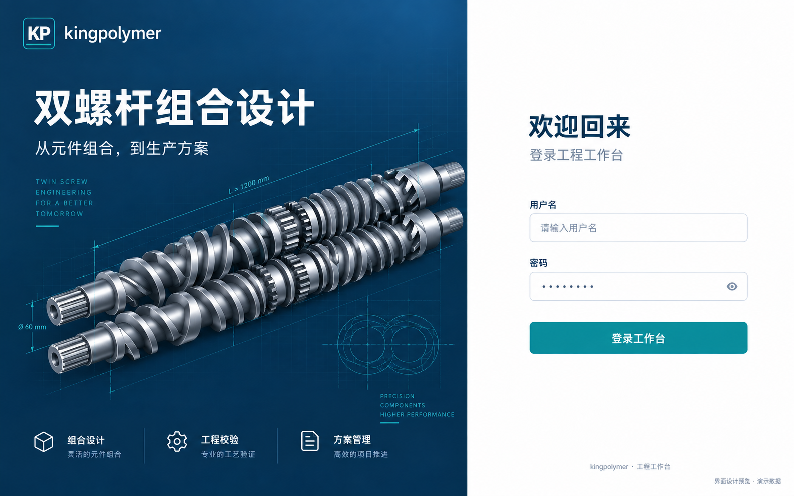
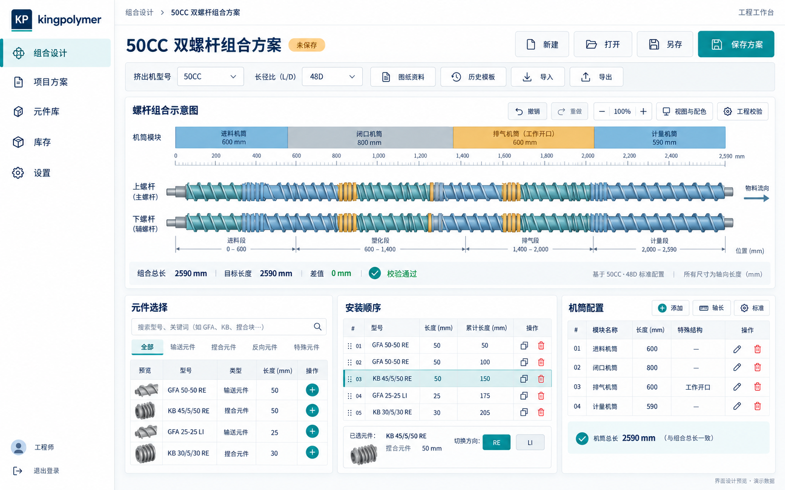
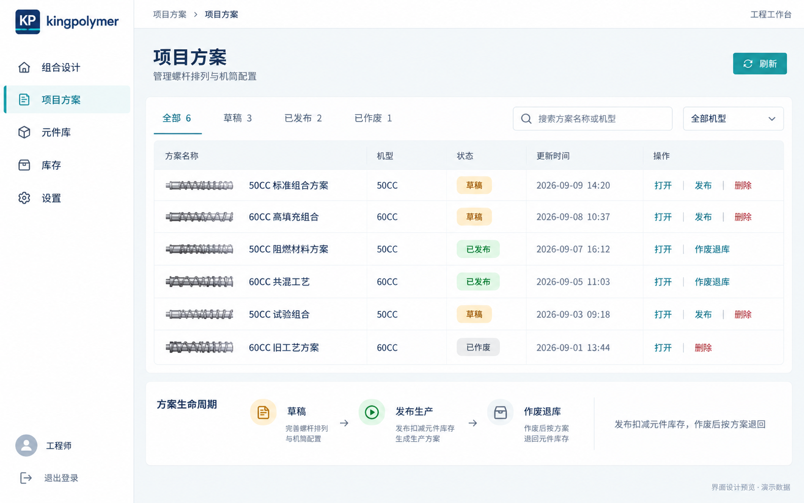
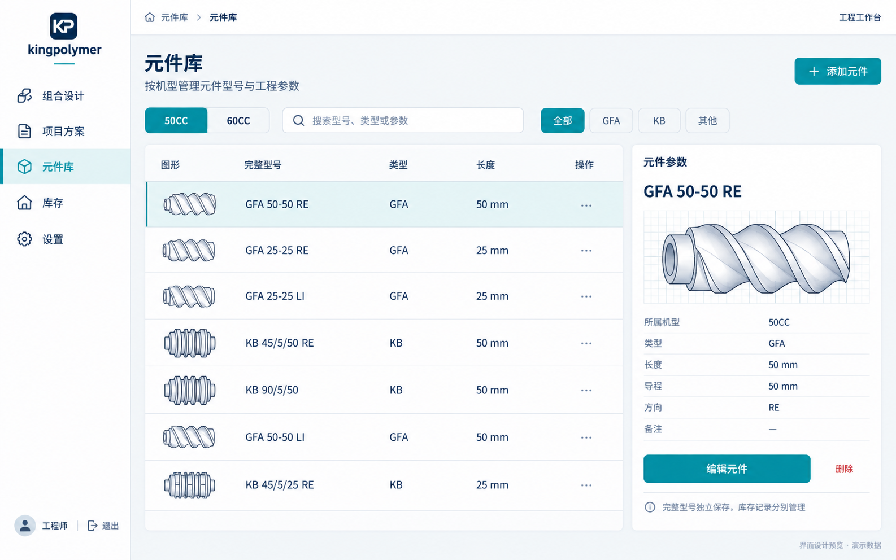
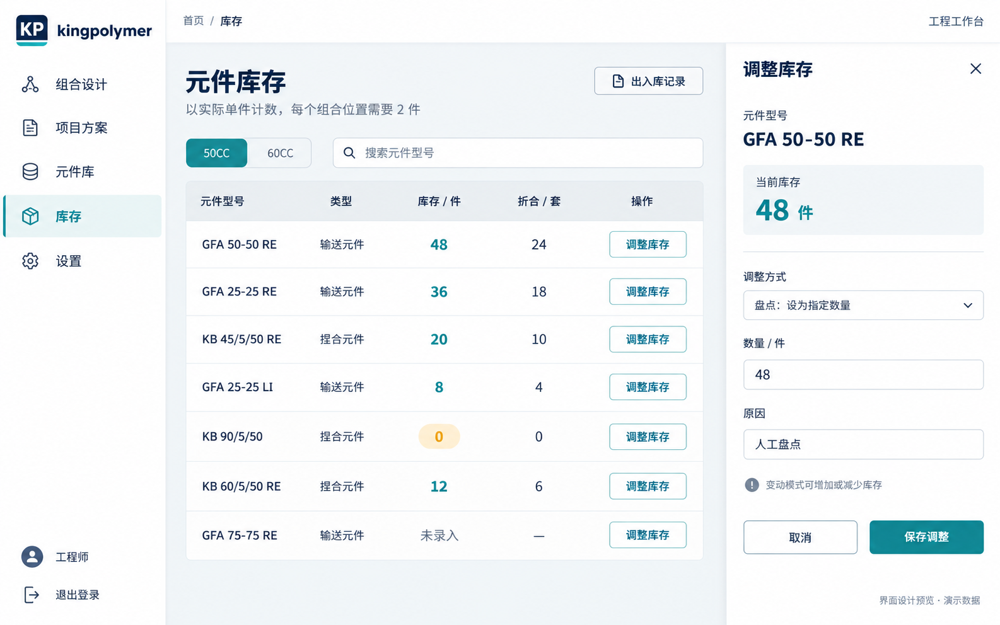
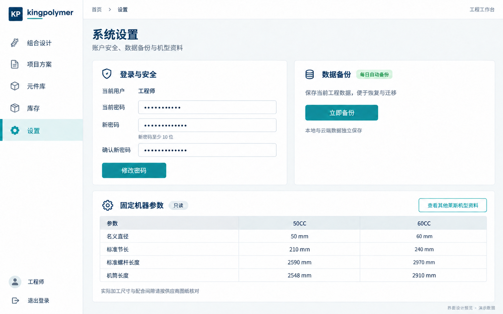
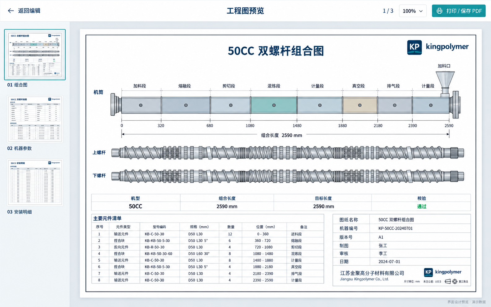

# kingpolymer UI 升级设计图

使用内置 image_gen 生成。依据 React 页面与业务功能制作，共 7 张。2.1 版本已参照这些设计图实现统一界面，并加入实际可交互的 3D 模型。图片中的方案名称、库存数量等为演示数据，实际页面以运行项目为准。固定机器尺寸参考项目 seed.json。

统一风格：现有 KP 深蓝品牌、青绿主色、浅灰背景、清晰表格、工程图优先。

方案状态筛选、元件详情侧栏、库存调整侧栏和分页图纸预览均已实现；以下提示词保留为本次设计的参考说明。

## 页面与提示词

### 登录页面

Use case: ui-mockup. Create ONE polished high-fidelity desktop web application UI redesign image for the existing kingpolymer twin-screw engineering workspace. Wide landscape 16:10, ideally 1920x1200 or larger, flat front-on screenshot, edge-to-edge application, no device frame, no collage. Production-feasible React interface. Crisp legible Simplified Chinese typography like Noto Sans SC with precise English model codes and tabular numbers. Brand inherited from project: rounded navy #123f63 square KP monogram with white lettering and thin turquoise underline, wordmark "kingpolymer". Restrained industrial precision: navy #123f63 typography, teal #168d91 primary buttons and active highlights, #f3f6f8 canvas, white panels, fine cool-gray 1px dividers, small 8px radii, subtle shadows, generous alignment, 8px spacing system. No purple gradients, glassmorphism, generic analytics charts, photos of people, invented AI features or coding/framework labels. All business values are illustrative; subtle bottom text "界面设计预览 · 演示数据". Except login and report, use identical left 208px WHITE sidebar with KP brand at top, nav rows in EXACT order "组合设计", "项目方案", "元件库", "库存", "设置", thin line icons, active row pale teal background with teal left marker. Bottom avatar "工程师" and logout icon. Main area slim white 64px top header with breadcrumb current page and right "工程工作台" small text. Clean enterprise design, meaningful density, primary actions clearly identifiable, no browser chrome.

LOGIN PAGE. No sidebar. Split composition: left 54% navy architectural panel, right 46% warm-white login form. Top-left KP brand and kingpolymer. Left large Chinese heading "双螺杆组合设计" with small subtitle "从元件组合，到生产方案". Hero object is a refined technical 3D illustration of two parallel intermeshing extrusion screw shafts, segmented brushed-steel conveying flights and kneading discs, thin turquoise dimension lines and subtle engineering grid, elegant restrained industrial product illustration. Lower left three small line-icon captions "组合设计" "工程校验" "方案管理". Right centered spacious 380px form, heading "欢迎回来", description "登录工程工作台", labels "用户名" and "密码", empty outlined inputs with placeholders "请输入用户名" and masked password dots, password visibility eye. One prominent full-width teal button "登录工作台". Fine bottom caption "kingpolymer · 工程工作台". No signup, forgot password, social login, remember-me, or credentials. Gorgeous but practical enterprise login.

### 组合设计工作台

Use case: ui-mockup. Create ONE polished high-fidelity desktop web application UI redesign image for the existing kingpolymer twin-screw engineering workspace. Wide landscape 16:10, ideally 1920x1200 or larger, flat front-on screenshot, edge-to-edge application, no device frame, no collage. Production-feasible React interface. Crisp legible Simplified Chinese typography like Noto Sans SC with precise English model codes and tabular numbers. Brand inherited from project: rounded navy #123f63 square KP monogram with white lettering and thin turquoise underline, wordmark "kingpolymer". Restrained industrial precision: navy #123f63 typography, teal #168d91 primary buttons and active highlights, #f3f6f8 canvas, white panels, fine cool-gray 1px dividers, small 8px radii, subtle shadows, generous alignment, 8px spacing system. No purple gradients, glassmorphism, generic analytics charts, photos of people, invented AI features or coding/framework labels. All business values are illustrative; subtle bottom text "界面设计预览 · 演示数据". Except login and report, use identical left 208px WHITE sidebar with KP brand at top, nav rows in EXACT order "组合设计", "项目方案", "元件库", "库存", "设置", thin line icons, active row pale teal background with teal left marker. Bottom avatar "工程师" and logout icon. Main area slim white 64px top header with breadcrumb current page and right "工程工作台" small text. Clean enterprise design, meaningful density, primary actions clearly identifiable, no browser chrome.

DESIGNER PAGE, active "组合设计". Main heading "50CC 双螺杆组合方案" with amber "未保存" pill, actions "新建" "打开" "另存" primary "保存方案". Next compact toolbar machine select "50CC", "48D", "图纸资料", "历史模板", "导入", "导出". High usable information density. Central dominant white engineering canvas spans main width (about 40% screen height); controls undo/redo, zoom "100%", "视图与配色", "工程校验". Canvas contains TWO parallel horizontal segmented screw shaft vectors with accurate-looking conveying helical thread symbols and kneading disc stacks, muted teal blue amber colors by element type; barrel module strip above, thin mm ruler, feed direction at RIGHT. Small clean dimension annotations. Under canvas an engineering status strip labels "组合总长 2590 mm" "目标长度 2590 mm" "差值 0 mm" and green "校验通过". Lower half THREE panels: left "元件选择" search and type filter then 4 rows with tiny geometric screw thumbnails, example models "GFA 50-50 RE", "KB 45/5/50 RE", "GFA 25-25 LI", plus add icons. Middle wider "安装顺序" tidy table showing positions 01–05, model, length, cumulative length; selected row teal, reorder handles and duplicate/delete icons; bottom selected element action "切换方向 RE / LI". Right "机筒配置" list of 4 module rows with lengths, e.g. "进料机筒" "闭口机筒" "排气机筒", header small "添加" "轴长" "标准" controls, one row showing "工作开口". Keep vector diagram clear and not decorative random machinery. Everything fits one screen, generous enough readable Chinese.

### 项目方案

Use case: ui-mockup. Create ONE polished high-fidelity desktop web application UI redesign image for the existing kingpolymer twin-screw engineering workspace. Wide landscape 16:10, ideally 1920x1200 or larger, flat front-on screenshot, edge-to-edge application, no device frame, no collage. Production-feasible React interface. Crisp legible Simplified Chinese typography like Noto Sans SC with precise English model codes and tabular numbers. Brand inherited from project: rounded navy #123f63 square KP monogram with white lettering and thin turquoise underline, wordmark "kingpolymer". Restrained industrial precision: navy #123f63 typography, teal #168d91 primary buttons and active highlights, #f3f6f8 canvas, white panels, fine cool-gray 1px dividers, small 8px radii, subtle shadows, generous alignment, 8px spacing system. No purple gradients, glassmorphism, generic analytics charts, photos of people, invented AI features or coding/framework labels. All business values are illustrative; subtle bottom text "界面设计预览 · 演示数据". Except login and report, use identical left 208px WHITE sidebar with KP brand at top, nav rows in EXACT order "组合设计", "项目方案", "元件库", "库存", "设置", thin line icons, active row pale teal background with teal left marker. Bottom avatar "工程师" and logout icon. Main area slim white 64px top header with breadcrumb current page and right "工程工作台" small text. Clean enterprise design, meaningful density, primary actions clearly identifiable, no browser chrome.

PROJECTS PAGE active "项目方案". Heading "项目方案", subtitle "管理螺杆排列与机筒配置", top right "刷新". Clean useful table-centric page, not dashboard. Slim status-filter tabs "全部 6" "草稿 3" "已发布 2" "已作废 1"; search "搜索方案名称或机型", machine filter "全部机型". Main white table with exact columns "方案名称" "机型" "状态" "更新时间" "操作". Six spacious rows example names "50CC 标准组合方案" "60CC 高填充组合" "50CC 阻燃材料方案" "60CC 共混工艺" "50CC 试验组合" "60CC 旧工艺方案"; models50CC/60CC, example dates2026-09-09. Status pills 3amber drafts,2green released,1gray void; draft actions "打开" "发布" and muted red "删除"; released actions "打开" "作废退库"; void actions "打开" "删除". A subtle screw-sequence thumbnail next to each project name gives engineering identity. Below table quiet workflow card with icons and text "草稿" → "发布生产" → "作废退库", explanation "发布扣减元件库存，作废后按方案退回". No fake cloud sync, analytics, collaborators or sales metrics.

### 元件库

Use case: ui-mockup. Create ONE polished high-fidelity desktop web application UI redesign image for the existing kingpolymer twin-screw engineering workspace. Wide landscape 16:10, ideally 1920x1200 or larger, flat front-on screenshot, edge-to-edge application, no device frame, no collage. Production-feasible React interface. Crisp legible Simplified Chinese typography like Noto Sans SC with precise English model codes and tabular numbers. Brand inherited from project: rounded navy #123f63 square KP monogram with white lettering and thin turquoise underline, wordmark "kingpolymer". Restrained industrial precision: navy #123f63 typography, teal #168d91 primary buttons and active highlights, #f3f6f8 canvas, white panels, fine cool-gray 1px dividers, small 8px radii, subtle shadows, generous alignment, 8px spacing system. No purple gradients, glassmorphism, generic analytics charts, photos of people, invented AI features or coding/framework labels. All business values are illustrative; subtle bottom text "界面设计预览 · 演示数据". Except login and report, use identical left 208px WHITE sidebar with KP brand at top, nav rows in EXACT order "组合设计", "项目方案", "元件库", "库存", "设置", thin line icons, active row pale teal background with teal left marker. Bottom avatar "工程师" and logout icon. Main area slim white 64px top header with breadcrumb current page and right "工程工作台" small text. Clean enterprise design, meaningful density, primary actions clearly identifiable, no browser chrome.

COMPONENT CATALOG PAGE active "元件库". Heading "元件库", subtitle "按机型管理元件型号与工程参数", primary "添加元件". Machine segmented selection "50CC" active / "60CC"; search "搜索型号、类型或参数"; type chips "全部" "GFA" "KB" "其他". Primary white content split into large 68% technical data table and 32% selected component detail panel (UI upgrade uses same existing fields). Table columns "图形" "完整型号" "类型" "长度" "操作", seven airy rows with accurate-looking outlined miniature helical conveying screw or stacked kneading disk symbols, example codes "GFA 50-50 RE", "GFA 25-25 RE", "GFA 25-25 LI", "KB 45/5/50 RE", "KB 90/5/50", lengths25mm/50mm. Selected first row pale teal. Right white detail card heading "元件参数", model "GFA 50-50 RE", enlarged handsome technical screw element preview on a faint engineering grid; below definition fields "所属机型 50CC" "类型 GFA" "长度 50 mm" "导程 50 mm" "方向 RE" "备注 —". Buttons "编辑元件" and text "删除". Bottom subtle note "完整型号独立保存，库存记录分别管理". No retail shopping, prices, stars, unrelated bearings; only twin-screw extruder elements.

### 库存管理

Use case: ui-mockup. Create ONE polished high-fidelity desktop web application UI redesign image for the existing kingpolymer twin-screw engineering workspace. Wide landscape 16:10, ideally 1920x1200 or larger, flat front-on screenshot, edge-to-edge application, no device frame, no collage. Production-feasible React interface. Crisp legible Simplified Chinese typography like Noto Sans SC with precise English model codes and tabular numbers. Brand inherited from project: rounded navy #123f63 square KP monogram with white lettering and thin turquoise underline, wordmark "kingpolymer". Restrained industrial precision: navy #123f63 typography, teal #168d91 primary buttons and active highlights, #f3f6f8 canvas, white panels, fine cool-gray 1px dividers, small 8px radii, subtle shadows, generous alignment, 8px spacing system. No purple gradients, glassmorphism, generic analytics charts, photos of people, invented AI features or coding/framework labels. All business values are illustrative; subtle bottom text "界面设计预览 · 演示数据". Except login and report, use identical left 208px WHITE sidebar with KP brand at top, nav rows in EXACT order "组合设计", "项目方案", "元件库", "库存", "设置", thin line icons, active row pale teal background with teal left marker. Bottom avatar "工程师" and logout icon. Main area slim white 64px top header with breadcrumb current page and right "工程工作台" small text. Clean enterprise design, meaningful density, primary actions clearly identifiable, no browser chrome.

INVENTORY PAGE active "库存". Heading "元件库存", clear subtitle "以实际单件计数，每个组合位置需要 2 件". Top right outlined "出入库记录". Machine toggle "50CC" / "60CC", search "搜索元件型号". Main white table columns "元件型号" "类型" "库存 / 件" "折合 / 套" "操作"; 7 example rows "GFA 50-50 RE"48/24, "GFA 25-25 RE"36/18, "KB 45/5/50 RE"20/10, "GFA 25-25 LI"8/4, "KB 90/5/50"0/0, "KB 60/5/50 RE"12/6, "GFA 75-75 RE"未录入/—. Teal numeric emphasis, zero amber pill. Row actions "调整库存". At right show an OPEN side drawer (about 350px) integrated without dark obscuring overlay, heading "调整库存" and close X; selected model "GFA 50-50 RE"; summary "当前库存 48 件"; labels "调整方式" dropdown "盘点：设为指定数量"; "数量 / 件" input48; "原因" input "人工盘点"; bottom buttons "取消" and teal "保存调整". A muted note "变动模式可增加或减少库存". Show rest of table sufficiently wide/readable. No procurement, warehouse management, forecasting, bar charts, unsupported thresholds.

### 系统设置

Use case: ui-mockup. Create ONE polished high-fidelity desktop web application UI redesign image for the existing kingpolymer twin-screw engineering workspace. Wide landscape 16:10, ideally 1920x1200 or larger, flat front-on screenshot, edge-to-edge application, no device frame, no collage. Production-feasible React interface. Crisp legible Simplified Chinese typography like Noto Sans SC with precise English model codes and tabular numbers. Brand inherited from project: rounded navy #123f63 square KP monogram with white lettering and thin turquoise underline, wordmark "kingpolymer". Restrained industrial precision: navy #123f63 typography, teal #168d91 primary buttons and active highlights, #f3f6f8 canvas, white panels, fine cool-gray 1px dividers, small 8px radii, subtle shadows, generous alignment, 8px spacing system. No purple gradients, glassmorphism, generic analytics charts, photos of people, invented AI features or coding/framework labels. All business values are illustrative; subtle bottom text "界面设计预览 · 演示数据". Except login and report, use identical left 208px WHITE sidebar with KP brand at top, nav rows in EXACT order "组合设计", "项目方案", "元件库", "库存", "设置", thin line icons, active row pale teal background with teal left marker. Bottom avatar "工程师" and logout icon. Main area slim white 64px top header with breadcrumb current page and right "工程工作台" small text. Clean enterprise design, meaningful density, primary actions clearly identifiable, no browser chrome.

SETTINGS PAGE active "设置". Heading "系统设置", subtitle "账户安全、数据备份与机型资料". Two balanced cards upper part and full-width technical parameter card below. Upper left "登录与安全" small shield icon, current user "工程师"; three neatly stacked password fields "当前密码", "新密码", "确认新密码" with masked dots; helper "新密码至少 10 位"; "修改密码" button. Upper right "数据备份" database icon, "每日自动备份" green subtle badge, description "保存当前工程数据，便于恢复与迁移", primary "立即备份", quiet note "本地与云端数据独立保存". Do not invent automatic sync or restore UI. Lower full-width "固定机器参数" with small "只读" tag and outlined "查看其他莱斯机型资料". Structured comparison table columns "参数" "50CC" "60CC", rows "名义直径" values50mm/60mm, "标准节长" values210mm/240mm, "标准螺杆长度" values2590mm/2970mm, "机筒长度" values2548mm/2910mm; these are illustrative. Small note "实际加工尺寸与配合间隙请按供应商图纸核对". Do not expose confirmation codes or actual account credentials, no theme toggles, notifications, billing, React text or server paths. Spacious careful form hierarchy.

### 工程图预览

Use case: ui-mockup. Create ONE polished high-fidelity desktop web application UI redesign image for the existing kingpolymer twin-screw engineering workspace. Wide landscape 16:10, ideally 1920x1200 or larger, flat front-on screenshot, edge-to-edge application, no device frame, no collage. Production-feasible React interface. Crisp legible Simplified Chinese typography like Noto Sans SC with precise English model codes and tabular numbers. Brand inherited from project: rounded navy #123f63 square KP monogram with white lettering and thin turquoise underline, wordmark "kingpolymer". Restrained industrial precision: navy #123f63 typography, teal #168d91 primary buttons and active highlights, #f3f6f8 canvas, white panels, fine cool-gray 1px dividers, small 8px radii, subtle shadows, generous alignment, 8px spacing system. No purple gradients, glassmorphism, generic analytics charts, photos of people, invented AI features or coding/framework labels. All business values are illustrative; subtle bottom text "界面设计预览 · 演示数据". Except login and report, use identical left 208px WHITE sidebar with KP brand at top, nav rows in EXACT order "组合设计", "项目方案", "元件库", "库存", "设置", thin line icons, active row pale teal background with teal left marker. Bottom avatar "工程师" and logout icon. Main area slim white 64px top header with breadcrumb current page and right "工程工作台" small text. Clean enterprise design, meaningful density, primary actions clearly identifiable, no browser chrome.

ENGINEERING REPORT PREVIEW, separate full-width viewer replacing main sidebar. Top WHITE64px bar left "← 返回编辑", center "工程图预览", right page indicator "1 / 3" zoom "100%" and teal "打印 / 保存 PDF". Light cool-gray workspace. Narrow left thumbnail rail180px showing three landscape pages labeled "01 组合图", "02 机器参数", "03 安装明细"; first selected teal outline. Central landscape white A4-like paper with light shadow and precise thin black drawing border, substantial margins, visible full sheet. Page title "50CC 双螺杆组合图", KP small in top right. Main drawing clean technical black/gray fine linework with limited muted engineering colors: barrel sections strip, dimension ruler, two horizontal intermeshing segmented screw shafts composed of conveying flights and kneading blocks. Feeding label at RIGHT. Beneath drawing engineering summary table "机型 50CC" "组合长度 2590 mm" "目标长度 2590 mm" "校验 通过". Lower paper third includes compact bill-of-elements table and technical title block fields "图纸名称" "机器编号" "版本号" "制图" "审核" "日期", filled with neutral demo values. Make this an elegant legible industrial report viewer, with paper labels mostly Chinese and model codes precise. No unrelated chart, marketing prose, full screen CAD toolbars, fake 3D controls. The other2 page thumbnails show parameter table and installation-order table.

## 设置页最终校正提示词

仅修改固定机器参数表最后一行：50CC 机筒长度为 2548 mm，60CC 机筒长度为 2910 mm。标准螺杆长度仍为 2590 mm 和 2970 mm。其余布局、文字与颜色保持不变。
